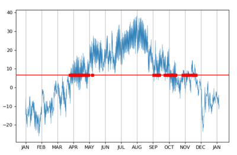
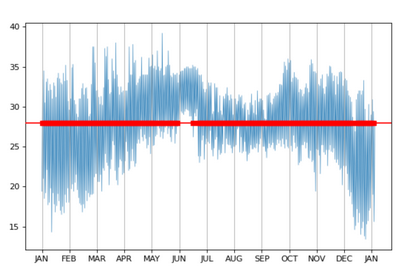
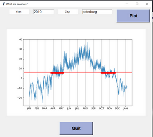

# Анализ погодных данных
## Статистическое определение сезонов
Для анализа берутся данные о температуре воздуха в данном населенном пункте
за год. Желательная частота выборки - дважды в сутки.
Вычисляется _средняя за год_ температура и определяются точки пересечения этой 
средней линии графиком температуры. В идеале имеются два относительно больших
промежутка, в которых таких пересечений нет. Это будут лето и зима.
Промежутки времени, где есть плотная частота точек пересечения можно считать
весной и летом.
## Примеры
Москва 2010 - ярко выражены оба вида сезонов  

Бомбей 2010 - нет _температурных_ сезонов  

## Описание GUI

## Технические особенности
Проект написан на Python 3.8  
Использованы free WEB API:  
- [geocode.xyz](https://geocode.xyz/api) - для получения географических 
координат по названию населенного пункта
- [meteostat](https://dev.meteostat.net/python/) - для поиска погодных данных по геопозиции  

Все необходимые библиотеки можно установить с помощью  
`pip install -r requirements.txt`
